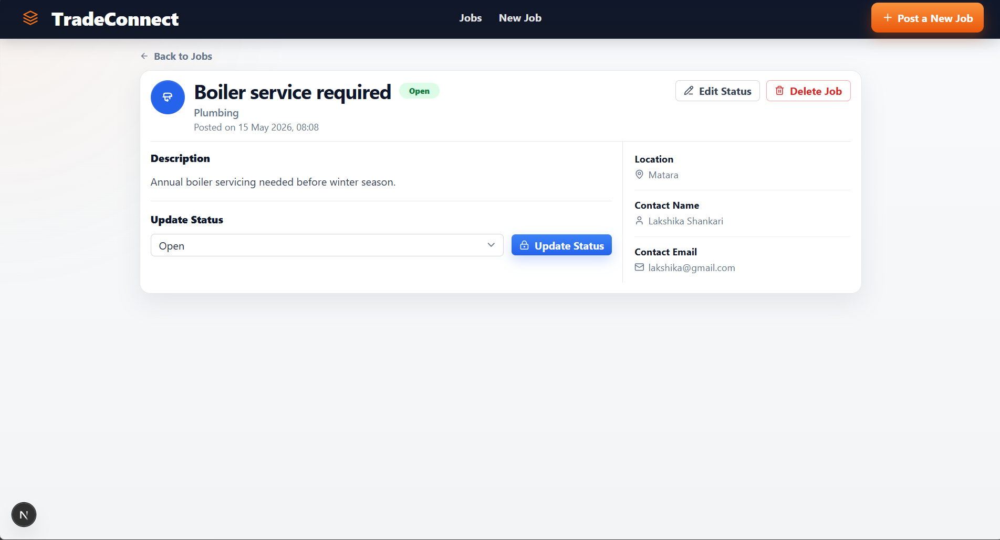

# TradeConnect – Mini Service Request Board

TradeConnect is a full-stack web application built for homeowners and local tradespeople to manage service requests efficiently. Homeowners can post repair or maintenance requests, while tradespeople can browse available jobs, view details, and update the work status.

This project was developed as part of a technical assessment using Next.js, Express.js, and MongoDB.

---

# Deployment Guide

The easiest free setup for this project is:

* Frontend: Vercel
* Backend: Render
* Database: MongoDB Atlas free tier

## Environment Variables

Backend environment:

```env
MONGODB_URI=your_mongodb_atlas_connection_string
PORT=4000
FRONTEND_URL=https://your-frontend.vercel.app
JWT_SECRET=your_long_random_secret
```

Frontend environment:

```env
NEXT_PUBLIC_API_BASE_URL=https://your-backend.onrender.com
```

## 1. Create MongoDB Atlas Database

1. Create a free MongoDB Atlas account.
2. Create a new cluster.
3. Create a database user and password.
4. Add your IP address to the network access list, or allow access from anywhere for the assessment.
5. Copy the connection string and use it as `MONGODB_URI`.

## 2. Deploy Backend to Render

1. Push the project to GitHub.
2. Open Render and create a new **Web Service** from the GitHub repo.
3. Set the root directory to `backend`.
4. Use these settings:
  * Build command: `npm install`
  * Start command: `npm start`
5. Add these environment variables in Render:
  * `MONGODB_URI`
  * `PORT` = `4000`
  * `FRONTEND_URL` = your final Vercel URL
  * `JWT_SECRET` = any long random string
6. Deploy and copy the backend URL.

## 3. Deploy Frontend to Vercel

1. Open Vercel and import the same GitHub repository.
2. Set the project root to `frontend`.
3. Add this environment variable in Vercel:
  * `NEXT_PUBLIC_API_BASE_URL` = your Render backend URL
4. Deploy the frontend.

## 4. Update CORS After Frontend URL Is Known

After Vercel gives you the production frontend URL, make sure the backend `FRONTEND_URL` value matches it exactly. If you redeploy the frontend later and the URL changes, update Render again.

## 5. Quick Verification

After both deployments finish:

1. Open the Vercel frontend URL.
2. Register a homeowner account.
3. Post a job.
4. Open the job as a tradesperson and change the status.

If any API call fails, check the browser console and confirm the frontend env variable points to the deployed backend URL.

---

# Live Demo

Frontend: [https://your-frontend-url.vercel.app](https://your-frontend-url.vercel.app)

Backend API: [https://your-backend-url.onrender.com](https://your-backend-url.onrender.com)

---

# Features

## Core Features

* View all service requests
* Create new job requests
* View individual job details
* Update job status
* Delete job requests
* Search jobs by keyword
* Filter jobs by category
* Filter jobs by status
* Responsive modern UI
* Form validation
* REST API integration

## Optional Features Implemented

* Keyword search
* Status filtering
* Deployment to cloud platforms
* Professional responsive UI

---

# Tech Stack

## Frontend

* Next.js (App Router)
* React.js
* Tailwind CSS
* Axios
* Lucide React Icons

## Backend

* Node.js
* Express.js
* MongoDB Atlas
* Mongoose

## Deployment

* Frontend: Vercel
* Backend: Render or Railway
* Database: MongoDB Atlas

---

# Project Structure

```bash
tradeconnect/
│
├── frontend/
│   ├── app/
│   ├── components/
│   └── lib/
## Screenshots

<p align="left">
  
</p>

<p align="left">
  
</p>
│
├── backend/
│   ├── models/
│   ├── routes/
│   ├── controllers/
│   ├── middleware/
│   └── server.js
│
└── README.md
```

---

# API Endpoints

| Method | Endpoint      | Description       |
| ------ | ------------- | ----------------- |
| GET    | /api/jobs     | Get all jobs      |
| GET    | /api/jobs/:id | Get single job    |
| POST   | /api/jobs     | Create a new job  |
| PATCH  | /api/jobs/:id | Update job status |
| DELETE | /api/jobs/:id | Delete a job      |

---

# Installation Guide

## 1. Clone Repository

```bash
git clone https://github.com/your-username/tradeconnect.git
```

---

# Backend Setup

## Navigate to backend

```bash
cd backend
```

## Install dependencies

```bash
npm install
```

## Create .env file

```env
PORT=5000
MONGO_URI=your_mongodb_connection_string
```

## Start backend server

```bash
npm run dev
```

Server runs on:

```bash
http://localhost:5000
```

---

# Frontend Setup

## Navigate to frontend

```bash
cd frontend
```

## Install dependencies

```bash
npm install
```

## Create .env.local file

```env
NEXT_PUBLIC_API_URL=http://localhost:5000/api
```

## Start frontend

```bash
npm run dev
```

Frontend runs on:

```bash
http://localhost:3000
```

---

# Screenshots

<table>
  <tr>
    <td><h2 style="text-align: center;">Home Page</h2><br/>
    <td>
    <td><h2 style="text-align: center;">Details Page</h2><br/>
    </td>
  </tr>
  <tr>
    <td><h2 style="text-align: center;">New Job Page</h2><br/>
    </td>
    
  </tr>
</table>

# Sample Job Request

```json
{
  "title": "Leaking kitchen tap",
  "description": "Kitchen tap leaking continuously since yesterday evening.",
  "category": "Plumbing",
  "location": "Glasgow",
  "contactName": "Sarah Thompson",
  "contactEmail": "sarah@example.com",
  "status": "Open"
}
```

---

# Validation Rules

* All required fields must be completed
* Email must be valid
* Empty submissions are prevented
* Invalid API requests return proper error messages

---

# Future Improvements

* JWT Authentication
* User roles
* File upload support
* Advanced search filters
* Email notifications
* Pagination

---

# License

This project was developed for educational and assessment purposes.
