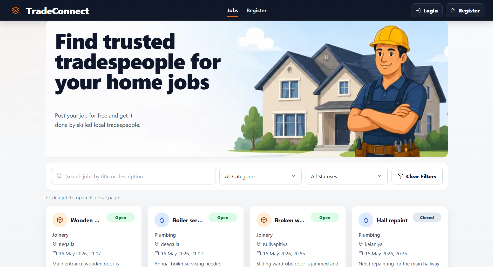
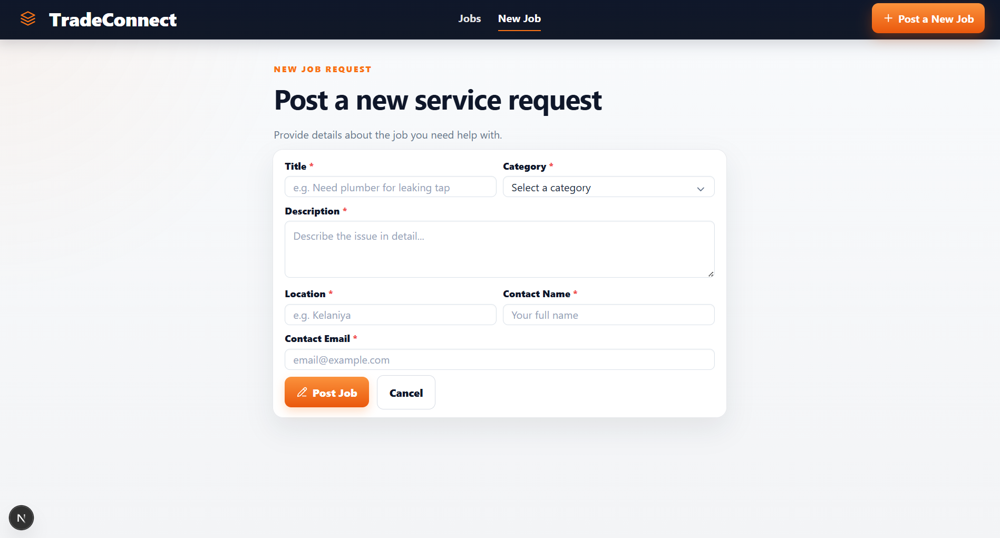

# TradeConnect – Mini Service Request Board

TradeConnect is a full-stack web application built for homeowners and local tradespeople to manage service requests efficiently. Homeowners can post repair or maintenance requests, while tradespeople can browse available jobs, view details, and update the work status.

This project was developed as part of a technical assessment using Next.js, Express.js, and MongoDB.

---

# Live Demo

Frontend: [https://your-frontend-url.vercel.app](https://your-frontend-url.vercel.app)

Backend API: [https://your-backend-url.onrender.com](https://your-backend-url.onrender.com)

---

# Features

## Core Features

* View all service requests
* Create new job requests
* View individual job details
* Update job status
* Delete job requests
* Search jobs by keyword
* Filter jobs by category
* Filter jobs by status
* Responsive modern UI
* Form validation
* REST API integration

## Optional Features Implemented

* Keyword search
* Status filtering
* Deployment to cloud platforms
* Professional responsive UI

---

# Tech Stack

## Frontend

* Next.js (App Router)
* React.js
* Tailwind CSS
* Axios
* Lucide React Icons

## Backend

* Node.js
* Express.js
* MongoDB Atlas
* Mongoose

## Deployment

* Frontend: Vercel
* Backend: Render

---

# Project Structure

```bash
tradeconnect/
│
├── frontend/
│   ├── app/
│   ├── components/
│   └── lib/
## Screenshots

<p align="left">
  
</p>

<p align="left">
  
</p>
│
├── backend/
│   ├── models/
│   ├── routes/
│   ├── controllers/
│   ├── middleware/
│   └── server.js
│
└── README.md
```

---

# API Endpoints

| Method | Endpoint      | Description       |
| ------ | ------------- | ----------------- |
| GET    | /api/jobs     | Get all jobs      |
| GET    | /api/jobs/:id | Get single job    |
| POST   | /api/jobs     | Create a new job  |
| PATCH  | /api/jobs/:id | Update job status |
| DELETE | /api/jobs/:id | Delete a job      |

---

# Installation Guide

## 1. Clone Repository

```bash
git clone https://github.com/your-username/tradeconnect.git
```

---

# Backend Setup

## Navigate to backend

```bash
cd backend
```

## Install dependencies

```bash
npm install
```

## Create .env file

```env
PORT=5000
MONGO_URI=your_mongodb_connection_string
```

## Start backend server

```bash
npm run dev
```

Server runs on:

```bash
http://localhost:5000
```

---

# Frontend Setup

## Navigate to frontend

```bash
cd frontend
```

## Install dependencies

```bash
npm install
```

## Create .env.local file

```env
NEXT_PUBLIC_API_URL=http://localhost:5000/api
```

## Start frontend

```bash
npm run dev
```

Frontend runs on:

```bash
http://localhost:3000
```

---

# Screenshots

<table>
  <tr>
    <td></td>
    <td></td>
  </tr>
  <tr>
    <td></td>
    
  </tr>
</table>

# Sample Job Request

```json
{
  "title": "Leaking kitchen tap",
  "description": "Kitchen tap leaking continuously since yesterday evening.",
  "category": "Plumbing",
  "location": "Glasgow",
  "contactName": "Sarah Thompson",
  "contactEmail": "sarah@example.com",
  "status": "Open"
}
```

---

# Validation Rules

* All required fields must be completed
* Email must be valid
* Empty submissions are prevented
* Invalid API requests return proper error messages

---

# Future Improvements

* JWT Authentication
* User roles
* File upload support
* Advanced search filters
* Email notifications
* Pagination

---

# License

This project was developed for educational and assessment purposes.
