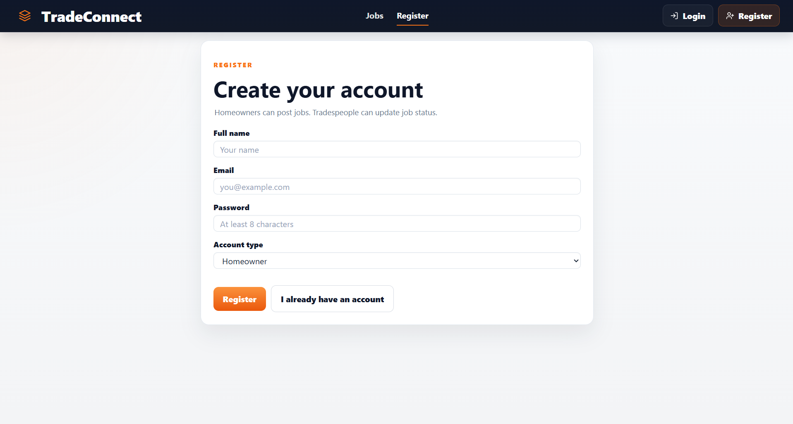
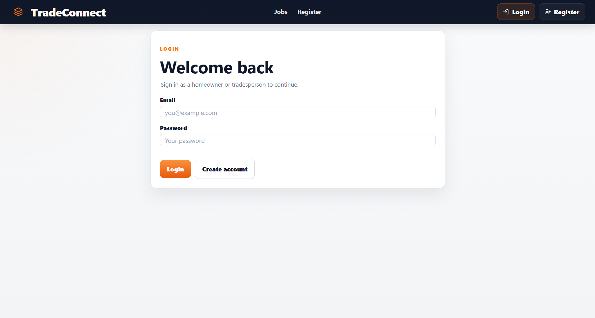
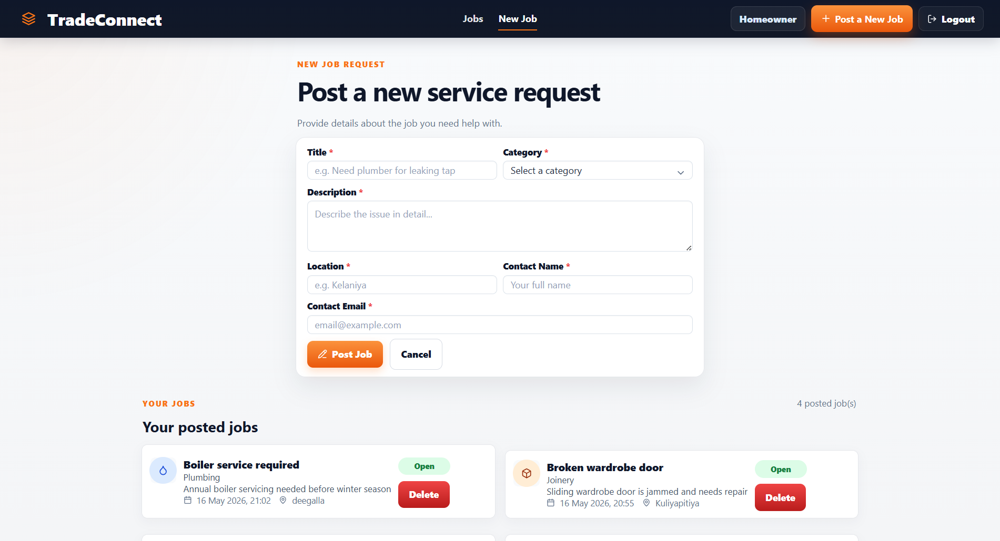
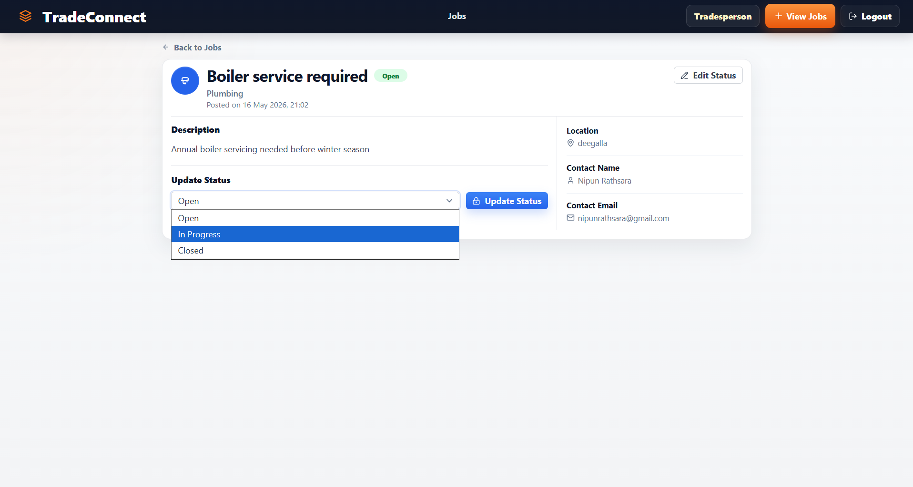

# TradeConnect – Mini Service Request Board

TradeConnect is a full-stack service request board where public users can browse posted jobs, homeowners can post and delete their own jobs, and tradespeople can view job details and update job status.

---

# Live Demo

Frontend Demo:  
https://trade-connect-frontend.vercel.app

Backend API:  
https://tradeconnect-backend-a3q9.onrender.com

Jobs API Endpoint:  
https://tradeconnect-backend-a3q9.onrender.com/api/jobs

---

# Features

## Public Users
- View all posted jobs
- Search jobs
- Filter jobs by category and status

## Homeowners
- Register and login
- Post new service requests
- View own posted jobs
- Delete own jobs

## Tradespeople
- Register and login
- View job details
- Update job status

## Additional Features
- JWT Authentication
- Password hashing with bcrypt
- Responsive modern UI
- REST API integration
- MongoDB Atlas database
- Cloud deployment

---

# Tech Stack

## Frontend
- Next.js
- React.js
- Tailwind CSS
- Axios
- Lucide React Icons

## Backend
- Node.js
- Express.js
- MongoDB Atlas
- Mongoose
- JWT Authentication
- bcryptjs

## Deployment
- Frontend: Vercel
- Backend: Render
- Database: MongoDB Atlas

---

# Project Structure

```bash
TradeConnect/
├── frontend/
├── backend/
├── screenshots/
│   ├── home.png
│   ├── details.png
│   └── new-job.png
└── README.md
```

---

# Screenshots

<table>
  <tr>
    <td>
      <h2 align="center">Home Page</h2>
      
    </td>
    <td>
      <h2 align="center">Register Page</h2>
      
    </td>
  </tr>
  <tr>
    <td>
      <h2 align="center">Login Page</h2>
      
    </td>
    <td>
      <h2 align="center">Home Owner Post New Job</h2>
      
    </td>
  </tr>
  <tr>
    <td>
      <h2 align="center">Tradesperson Update Status</h2>
      
    </td>
  </tr>
</table>

---

# User Roles Workflow

## Public User
- Can access home page
- Can browse all jobs
- Can search and filter jobs

## Homeowner
- Can register/login
- Can create service requests
- Can delete own posted jobs

## Tradesperson
- Can register/login
- Can view detailed job information
- Can update job status

---

# API Endpoints

| Method | Endpoint | Description |
|---|---|---|
| POST | `/api/auth/register` | Register user |
| POST | `/api/auth/login` | Login user |
| GET | `/api/jobs` | Get all jobs |
| GET | `/api/jobs/:id` | Get single job |
| POST | `/api/jobs` | Create new job |
| PATCH | `/api/jobs/:id/status` | Update job status |
| DELETE | `/api/jobs/:id` | Delete job |

---

# Local Installation

## 1. Clone Repository

```bash
git clone https://github.com/Thiyumi2003/TradeConnect.git
cd TradeConnect
```

---

# Backend Setup

## Install Dependencies

```bash
cd backend
npm install
```

## Create .env File

Create a `.env` file inside backend folder:

```env
PORT=4000
MONGODB_URI=your_mongodb_connection_string
JWT_SECRET=your_jwt_secret
```

## Run Backend

```bash
npm run dev
```

Backend runs on:

```txt
http://localhost:4000
```

---

# Frontend Setup

## Install Dependencies

```bash
cd frontend
npm install
```

## Create .env.local File

Create a `.env.local` file inside frontend folder:

```env
NEXT_PUBLIC_API_BASE_URL=http://localhost:4000
```

## Run Frontend

```bash
npm run dev
```

Frontend runs on:

```txt
http://localhost:3000
```

---

# Environment Variables

## Backend

```env
PORT=4000
MONGODB_URI=your_mongodb_connection_string
JWT_SECRET=your_jwt_secret
```

## Frontend

```env
NEXT_PUBLIC_API_BASE_URL=http://localhost:4000
```

## Production Frontend Variable

```env
NEXT_PUBLIC_API_BASE_URL=https://tradeconnect-backend-a3q9.onrender.com
```

---

# Deployment

## Frontend Deployment
Hosted on Vercel:

```txt
https://trade-connect-frontend.vercel.app
```

## Backend Deployment
Hosted on Render:

```txt
https://tradeconnect-backend-a3q9.onrender.com
```

## Database
Hosted on MongoDB Atlas.

---

# Sample Job Data

```json
{
  "title": "Leaking kitchen tap",
  "description": "Kitchen tap has been leaking continuously since yesterday evening.",
  "category": "Plumbing",
  "location": "Glasgow",
  "contactName": "Sarah Thompson",
  "contactEmail": "sarah@example.com",
  "status": "Open"
}
```

---

# Validation Features

- Required field validation
- Email format validation
- Protected routes
- Role-based authorization
- JWT authentication
- Password hashing

---

# Future Improvements

- Image upload support
- Email notifications
- Real-time chat
- Advanced filtering
- Pagination
- Ratings and reviews

---

# Author

Thiyumi Upasari

GitHub:  
https://github.com/Thiyumi2003
